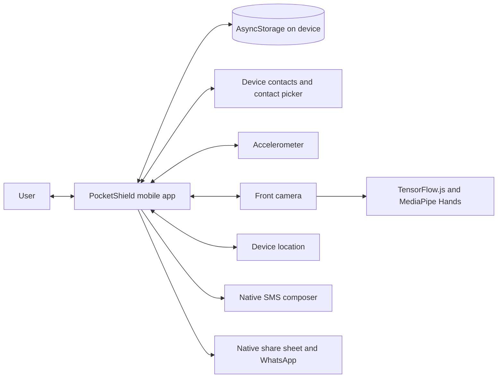
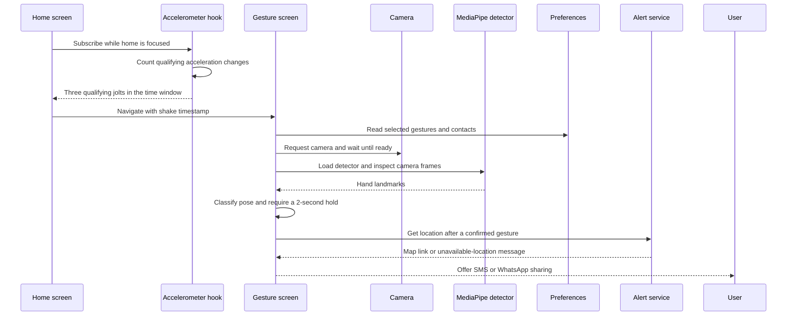

# PocketShield Architecture

## 1. System context

PocketShield is a client-side Expo application. It uses local storage for preferences and delegates contact selection, permission prompts, location, camera capture, and message sharing to device capabilities and installed apps.



There is no backend service in the current repository. The app does not send contacts, gesture preferences, or alert records to a PocketShield server.

## 2. Runtime and libraries

- Expo SDK with React Native and TypeScript
- Expo Router for file-based navigation
- `expo-sensors` for accelerometer readings
- `expo-camera` for gesture camera and optional video recording
- TensorFlow.js with `@tensorflow-models/hand-pose-detection` and MediaPipe Hands for hand landmarks
- `expo-contacts` for device contact access and the native contact picker
- AsyncStorage for on-device emergency contacts and selected gestures
- `expo-location` for a foreground location link
- `expo-sms`, React Native `Share`, and `expo-sharing` for user-confirmed messaging handoff

## 3. Source layout

| Module | Responsibility |
| --- | --- |
| `src/app/_layout.tsx` | Root stack, theme provider, and splash overlay |
| `src/app/index.tsx` | Home screen, onboarding redirects, settings drawer, shake response |
| `src/app/setup/contacts.tsx` | Contact permission, address-book selection, native picker, manual number entry |
| `src/app/setup/gestures.tsx` | Selection and local persistence of up to two gestures; microphone permission request |
| `src/app/gesture.tsx` | Camera permission and startup, TensorFlow model lifecycle, frame inference, hold timing, alert choices |
| `src/app/alert-recipients.tsx` | Standalone recipient selection and sequential draft flow |
| `src/app/video-alert.tsx` | Camera readiness, optional clip recording, and native video sharing |
| `src/hooks/use-shake-detector.ts` | Focus-scoped accelerometer subscription and shake thresholding |
| `src/logic/ai-decision.ts` | Landmark-based gesture rules and shake recency validation |
| `src/services/alert-service.ts` | Location text and SMS/WhatsApp message handoff helpers |
| `src/utils/storage.ts` | Storage keys, preference types, and AsyncStorage read/write helpers |
| `src/components/` | Shared visual components, including animated icon and web variants |

## 4. Navigation and onboarding

Expo Router derives routes from `src/app`. The root layout creates a stack with hidden native headers. On the home screen, a focus effect reads saved contacts and gestures. If contacts are missing, it replaces the current route with `/setup/contacts`; if gestures are missing, it routes to `/setup/gestures`. Saving contacts continues to gesture setup. Saving gestures returns to `/`.

The home settings drawer reopens either setup route so the saved preferences can be changed.

## 5. Trigger and gesture confirmation



The shake hook currently samples every 50 ms. It compares the change between consecutive acceleration vectors, counts qualifying changes within a 1.5-second window, and applies a short cooldown after detection. The gesture screen captures and downsizes camera frames, runs hand landmark inference, classifies the configured gestures, and resets the hold timer when a configured pose is no longer detected. A gesture trigger is accepted only while its originating shake timestamp is within the configured 60-second validity window.

## 6. Alert handoff and video

The alert service requests foreground location when needed and formats a map URL. If permission is missing or lookup fails, it returns a plain unavailable-location message. After gesture confirmation, the screen offers:

- **SMS:** Iterates saved phone numbers and opens a separate SMS draft for each. The user confirms each draft in the messaging UI. The platform response cannot establish that the carrier delivered a message.
- **WhatsApp:** Opens a native share interface containing the alert text. The user chooses WhatsApp and then a person or group.
- **Video:** Following a message flow, the user may opt into the video route. The camera records up to ten seconds, can stop early, and is silent if microphone access is unavailable. A native share sheet lets the user choose the destination and recipient.

No channel uses a server to deliver messages in the background. Opening a draft or share sheet is a handoff, not proof of sending or receipt.

## 7. Local data

`src/utils/storage.ts` uses AsyncStorage with these keys:

| Key | Stored value |
| --- | --- |
| `pocketshield_emergency_contacts` | JSON array of contact names and optional phone numbers |
| `pocketshield_selected_gestures` | JSON array of up to two supported gesture identifiers |
| `pocketshield_selected_gesture` | Legacy single-selection key read for a limited migration path |

Storage helpers catch read/write errors and return safe defaults. Data is local to the app installation and is not synchronized across devices.

## 8. Permissions

| Capability | Used by | Behavior if unavailable |
| --- | --- | --- |
| Contacts | Contact setup | User can use the native picker or enter numbers manually |
| Camera | Gesture and video screens | Gesture detection or video recording cannot proceed; the app shows a return path |
| Microphone | Video setup and recording | Video can be recorded silently |
| Foreground location | Alert text | Message explains that location is unavailable |

## 9. Configuration and local development

The Expo configuration is in `app.json`. The package scripts are in `package.json`. The current TensorFlow.js React Native package has a peer dependency conflict with the configured AsyncStorage version; in this checkout, dependency installation uses:

```bash
npm install --legacy-peer-deps
npx expo start
```

Some native module combinations may require an Expo development build rather than Expo Go. Validate on physical iOS and Android devices before release.

## 10. Known design boundaries

- Shake detection and pose classification are heuristic and device-dependent.
- Gesture matching is based on 2D landmark geometry and is not a security or safety guarantee.
- SMS and WhatsApp flows are user-mediated; the app cannot guarantee delivery or receipt.
- Video files are handed to system sharing; the app cannot confirm that the recipient received or played the clip.
- There is no backend, account management, encrypted cloud backup, alert logging service, or recipient acknowledgement protocol.
