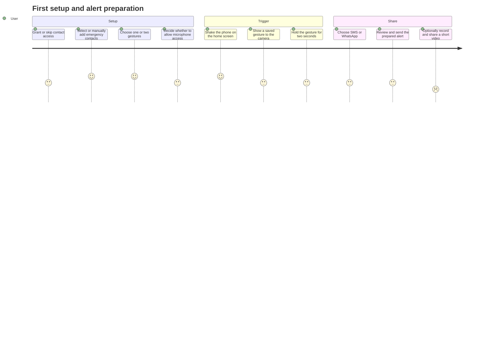

# PocketShield Product Requirements

## 1. Overview

PocketShield is a mobile safety app prototype designed to make it quicker for a person to prepare an alert when they feel unsafe. The person sets emergency contacts and chooses one or two recognizable hand gestures in advance. On the home screen, a phone shake opens a front-camera gesture check. If one selected gesture is recognized and held for two seconds, PocketShield offers messaging and optional video-sharing actions.

## 2. Problem

In a stressful situation, finding an app, navigating several screens, and identifying recipients can take time. PocketShield aims to make the trigger interaction simple by letting the person configure contacts and gestures before an incident.

## 3. Product goals

1. Make initial safety setup understandable and repeatable.
2. Let each person choose up to two gestures that are checked after a phone shake.
3. Require one selected gesture to be held for two seconds before presenting the alert choices.
4. Prepare alert text with a timestamp and a location link when location is available.
5. Let the person quickly enter a native SMS or WhatsApp sharing flow.
6. Offer optional short video sharing after the message flow, with audio only when microphone permission is granted.

## 4. Out of scope

- Silent or automatic message delivery.
- A PocketShield backend, user account system, cloud synchronization, or remote contact storage.
- Guaranteed delivery, recipient acknowledgements, or emergency-service dispatch.
- Sending video as an SMS attachment.
- Continuous location tracking or background monitoring.
- Treating gesture classification as a certified or fail-safe safety system.

## 5. Intended users

- People who want a fast, preconfigured way to prepare an alert for trusted contacts.
- A friend or family member helping someone configure the app.
- Developers evaluating a mobile safety interaction prototype.

## 6. Core user journey

## 7. Functional requirements

### 7.1 Onboarding and preferences

- The app must direct a first-time user to choose at least one emergency contact and at least one gesture before using the main safety flow.
- Contacts may be selected from the device address book, selected through the native contact picker, or entered manually.
- The app must allow up to two selected gestures from thumbs-up, open palm, peace sign, and fist.
- Contact and gesture preferences must be saved locally and restored when the app is reopened.
- The user must be able to edit contacts and gestures later from the home-screen settings menu.
- The gesture setup step should request microphone permission for optional video audio. Declining permission must not prevent setup; subsequent clips should be silent.

### 7.2 Shake and gesture trigger

- Shake detection must run while the home screen is focused.
- A detected shake must open the front-facing camera gesture screen.
- The gesture screen must use the saved gesture set; either saved gesture is sufficient.
- A matching gesture must remain detected for two seconds to confirm.
- If the selected pose is lost or changes to a non-selected gesture before the hold completes, the hold timer must reset.
- The app must show feedback while camera startup, hand detection, or gesture confirmation is in progress.
- The gesture recognition flow must stop after its timeout or when the screen is left.

### 7.3 Alert preparation

- After confirmation, the app must offer SMS and WhatsApp sharing choices.
- Alert text must include an emergency statement, the current time, and a Google Maps link when a location fix is available.
- If location permission is denied or location retrieval fails, the message must indicate location is unavailable.
- SMS sharing must open a separate draft for each saved contact, in sequence. The user must tap Send in the messaging UI for every draft. The app must not claim that delivery is confirmed.
- WhatsApp sharing must open a native share flow that allows the user to choose a person or group and send the prefilled message.
- If there are no saved contacts, the app must explain that a contact needs to be configured before an alert can be prepared.

### 7.4 Optional video

- After the messaging action, the app must offer an optional video flow.
- The front-facing camera must record up to ten seconds; the user may stop earlier.
- If microphone permission is granted, recorded clips may include audio. If denied, recording must remain available as a silent clip.
- The clip must be passed to the native sharing interface so the user can choose WhatsApp and recipients.
- The app must not claim a video was delivered just because the share interface opened.

## 8. Nonfunctional requirements

- The main screens must remain usable on typical portrait phone sizes.
- Permission denial must be handled with clear explanations and a usable path where possible.
- Contact and gesture data should remain on the device in the current architecture.
- Camera/model startup failures should show an actionable state rather than leaving a permanent loading screen.
- The app should not imply that inference, SMS, WhatsApp, location, or video sharing is guaranteed.

## 9. Success criteria

- A first-time user can complete contact and gesture setup and return to the home screen.
- A returning user sees saved setup and can edit it.
- A shake opens the gesture screen, and either selected gesture can independently satisfy the two-second confirmation rule.
- The alert message includes a location link when permission and a position are available and a clear fallback otherwise.
- SMS opens individual drafts for saved contacts, while WhatsApp allows the user to choose a person or group.
- A user can record a clip shorter than ten seconds and open the system sharing flow, with audio governed by microphone permission.

## 10. Constraints and risks

- Mobile operating systems require user interaction to send SMS or WhatsApp messages through ordinary app integrations. Message handoff is not equivalent to delivery.
- Accelerometer thresholds vary by device and may need tuning.
- Landmark-based pose classification may be sensitive to camera angle, lighting, hand orientation, occlusion, and individual movement.
- TensorFlow.js and Expo native module compatibility must be verified on each supported SDK/device combination.
- Expo Go may not provide every native capability needed for the final app; a development build may be required.
- Product safety claims require careful testing and review before any public release.

## 11. Current implementation snapshot

This document reflects the current repository implementation. It is a prototype: alerts require user action in the target messaging app, video is shared through a system share sheet, and no server-side alert delivery or acknowledgement service is implemented.
