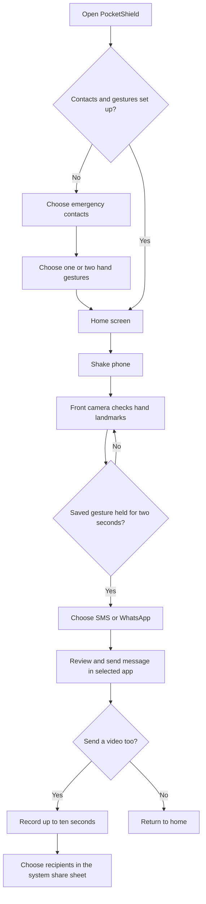

# PocketShield
PocketShield is an emergency safety app prototype designed to help you alert the people you trust when you may be in danger. After setting up your emergency contacts and choosing one or two hand gestures, shake your phone to open the safety camera. Hold either saved gesture for two seconds, and PocketShield prepares an alert with the time and your location when available. You can share the alert through SMS or WhatsApp, then record and share a short video. Having your location link ready and the video recording flow close at hand can save you from composing those details from scratch in a stressful moment. You still choose recipients and confirm sending in the messaging or sharing app.

The app is built with Expo, React Native, and TypeScript. It currently targets iOS and Android, with Expo Router providing the app's route structure.

## How it works



PocketShield prepares messages and opens the selected messaging app or system share sheet. It does not silently send messages: the person must review and tap Send in the messaging app. SMS drafts are opened separately for each saved emergency contact. WhatsApp opens a share flow where a recipient or group can be selected.

## Features

- First-run setup for emergency contacts and preferred safety gestures.
- Selection of up to two gestures: thumbs-up, open palm, peace sign, and fist.
- Shake detection on the home screen using the device accelerometer.
- Hand landmark detection using MediaPipe Hands through TensorFlow.js.
- A two-second hold requirement before the emergency sharing choices appear.
- Emergency message text that includes the time and a location link when location access is available.
- User-confirmed SMS and WhatsApp sharing.
- Optional video recording for up to ten seconds, with audio when microphone permission is granted.
- Local persistence of contact and gesture preferences on the device.

## Requirements

- Node.js and npm
- Expo Go on a compatible phone, or an iOS/Android development environment
- A physical phone for shake, camera, contacts, microphone, location, and messaging behavior

Some native capabilities and model/runtime combinations may require a development build instead of Expo Go. Expo Go behavior can also differ from a production build.

## Run the app

Install the dependencies:

```bash
npm install --legacy-peer-deps
```

The legacy peer dependency option is currently needed because `@tensorflow/tfjs-react-native` declares an older AsyncStorage peer dependency than the version used by this project. Review dependency upgrades deliberately before removing this option.

Start Expo:

```bash
npx expo start
```

Scan the development server's QR code with Expo Go. If the phone cannot reach the computer over the local network, start Expo with a tunnel:

```bash
npx expo start --tunnel
```

For platform-specific launch commands, use `npm run ios`, `npm run android`, or `npm run web` where the corresponding environment is available.

## Project structure

| Path | Purpose |
| --- | --- |
| `src/app/` | Expo Router screens and navigation routes |
| `src/app/setup/contacts.tsx` | Contact permission, selection, and manual contact entry |
| `src/app/setup/gestures.tsx` | Gesture selection and microphone permission request |
| `src/app/gesture.tsx` | Camera startup, hand landmark inference, hold timing, and alert choices |
| `src/app/video-alert.tsx` | Optional video recording and sharing |
| `src/services/alert-service.ts` | Location link generation and SMS/WhatsApp handoff |
| `src/logic/ai-decision.ts` | Gesture shape classification and emergency window check |
| `src/utils/storage.ts` | Local contacts and gesture persistence |
| `src/hooks/use-shake-detector.ts` | Accelerometer-based shake detection |
| `src/components/` | Shared UI components |
| `assets/` | App icons, splash assets, and imagery |
| `PRD.md` | Product requirements and acceptance criteria |
| `ARCHITECTURE.md` | Application structure and runtime flows |

## Privacy and safety notes

- Contacts and gesture preferences are stored locally with AsyncStorage. This project does not include a backend account or remote contact database.
- Contact, camera, microphone, and location access are requested for their corresponding app features. The app can continue without location permission, but the message then states that location is unavailable. A clip can be recorded silently when microphone access is denied.
- Message delivery depends on the user's messaging apps, device capabilities, network, carrier, and explicit send action. The app cannot verify that a recipient received or read an alert.
- Gesture recognition is a prototype using landmark geometry. It can misclassify poses and should not be treated as a guaranteed emergency service or a substitute for contacting local emergency services.
- Test messaging only with people who have agreed to receive test alerts. Confirm permission behavior and sharing flows on the target devices before relying on the app.

## Development checks

TypeScript can be checked with:

```bash
npx tsc --noEmit
```

The repository also defines `npm run lint` through Expo. No automated test suite is currently configured.

## Documentation

- [Product requirements](PRD.md)
- [Architecture](ARCHITECTURE.md)

## License

This repository currently includes the Expo MIT license in `LICENSE`. Review ownership and licensing before publishing or distributing the app as a product.
